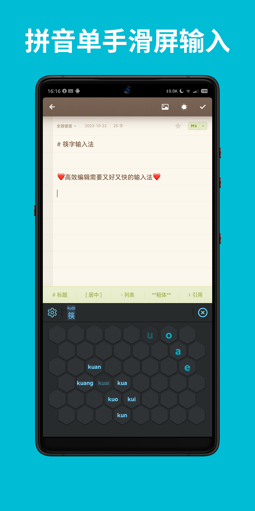
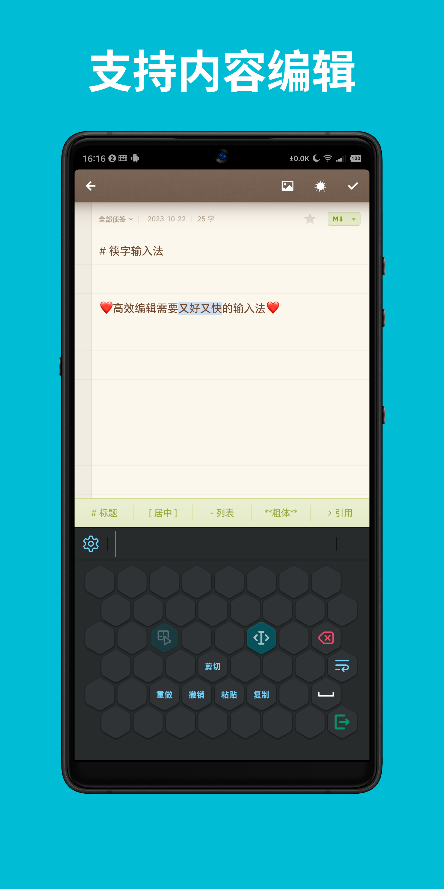
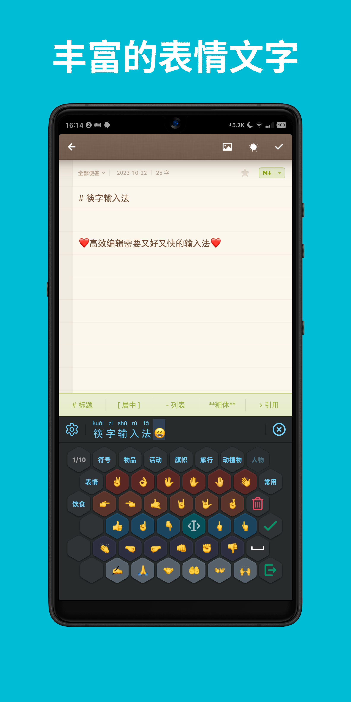
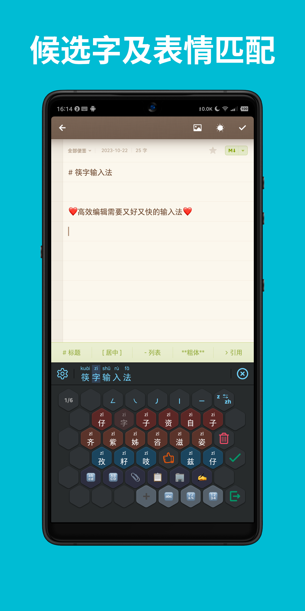
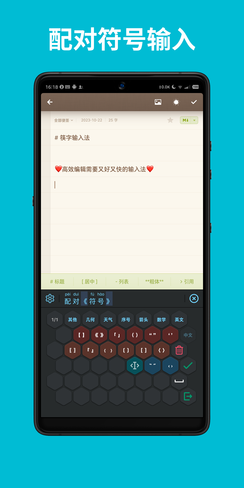
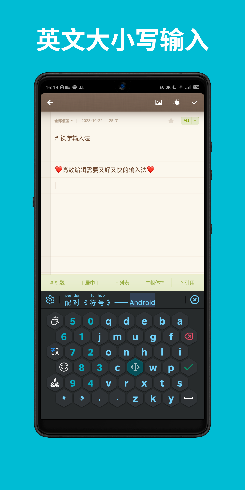
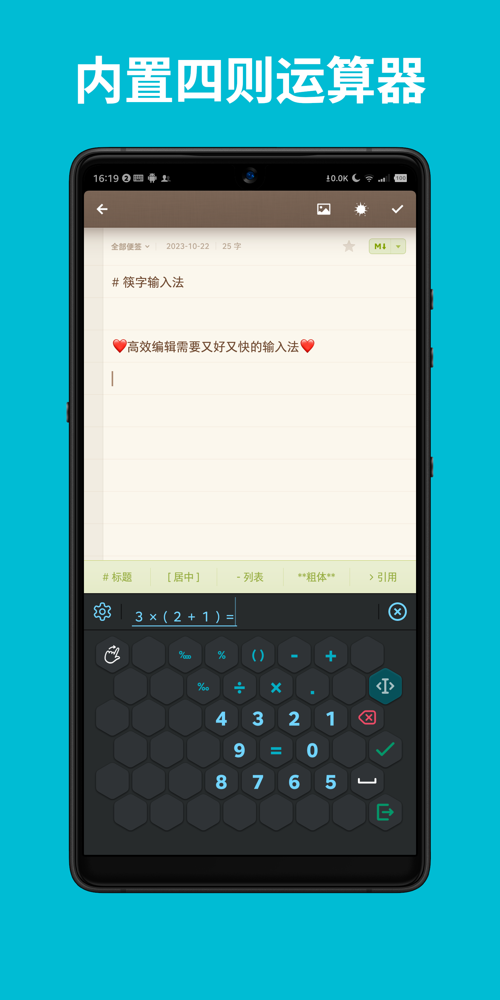
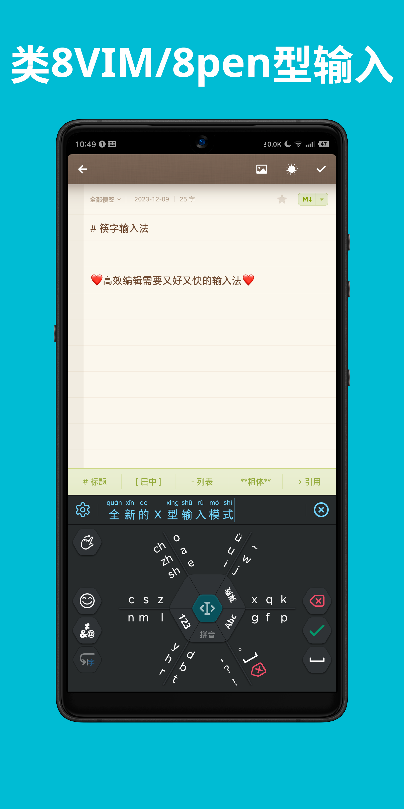

筷字输入法 (Kuaizi IME)
=======================================


> To download the latest version for Android,
> please go to https://github.com/crazydan-studio/kuaizi-ime-android/releases/latest

[](https://f-droid.org/packages/org.crazydan.studio.app.ime.kuaizi)

> **Warning**：筷字输入法(Kuaizi IME) is currently exclusively released
> on [F-Droid](https://f-droid.org) and has not been published on other application platforms.
> Please be cautious and aware of related risks. If you need to download and use it,
> please use the link above.

> If you find any errors or have improvement suggestions,
> please visit [Issues](https://github.com/crazydan-studio/kuaizi-ime/issues)

**筷字输入法** (Kuaizi IME) is a system based on the combinatorial features of Chinese Pinyin.
It is an efficient and fast input method editor, suitable for electronic touchscreen devices.

**筷字输入法** (Kuaizi IME) abandones the traditional method of tapping on virtual keyboard keys one by one,
it instead offers a swipe input method for Pinyin, combined with the combinatorial features of Pinyin letters.
The key layout is designed to make Pinyin input more accurate and convenient.

**筷字输入法** (Kuaizi IME) provides editing support such as cursor movement
and text selection for the target editor, thereby eliminating the frustration
of being unable to accurately position inputs and text due to the small screen size of mobile devices.
This further enhances text input and editing efficiency on small-screen devices.

User-data generated by **筷字输入法** (Kuaizi IME) is stored locally.
It does not connect to the internet and will not collect nor analyze user data or behavior habits.
Furthermore, it does not support or provide predictive input nor fuzzy matching mechanisms.
To some extent, this input method editor aims to enhance the users' ability to recognize
and memorize Chinese characters and Pinyin, ensuring that the reliance on digital tools
does not lead to the gradual forgetting and eventual abandonment of
<b>「汉字」</b> (Hànzì, Chinese characters), a treasure of Chinese civilization.

## About the icon

**筷字输入法** The icon is composed of the Chinese character <b>「字」</b> (zì, character)
and the Chinese-style utensil <b>「筷子」</b> (Kuàizi, chopsticks).
This combination closely links Chinese civilization with the unique culinary culture of its people,
showcasing the long history of Chinese civilization.
It also helps to spread traditional Chinese culture to the world,
deepening global friends' understanding and appreciation of Chinese culture.
At the same time, it allows the Chinese people to have a stronger confidence in their national culture.

## How to clone the repository

```bash
git clone git@github.com:crazydan-studio/kuaizi-ime.git

cd kuaizi-ime
git submodule update --init android
```

> For detailed build instructions, please refer to the README documentation of each module.

## Project structure

- [android/](https://github.com/crazydan-studio/kuaizi-ime-android):
  The complete project code for the 筷字输入法 (Kuaizi IME) Android client.
  Note: Use the command `git submodule update --init android` to initialize this git submodule.
- [docs/](./docs/): The documentation directory of this project.
  - [Cross-shaped input interaction design](./docs/design/cross-mode.md):
    Optimization and improvement plan for cross-shaped input.
- [tools/analyze/](./tools/analyze/):
  Pinyin key layout online analysis tool, used to analyze the letter combination structure of Pinyin
  and validate the layout scheme of the regular hexagonal keys.
- [tools/pinyin-dict/](./tools/pinyin-dict/):
  Pinyin dictionary data collection and correction program,
  which collects Chinese character data and generates an SQLite database.
  The character/dictionary database for the 筷字输入法 (Kuaizi IME) client is also generated by this tool.
- [thirdparty/](./thirdparty/):
  Third-party character and word data used in this project. **Note:** Use the command
  `git submodule update --init thirdparty/OpenCC thirdparty/pinyin-data`
  to initialize the git-submodules within this directory.

## License

[Apache 2.0](./LICENSE)

## Donations

**Note**：Please add the remark `筷字输入法` when donating.
For a complete list of donations, please check the [Donation list](./docs/donate/index.md)。

| 支付宝 (Alipay) | 微信支付 (WeChat Pay) |
| -- | -- |
|  |  |

## Feature Highlights

- Input Pinyin via a swiping motion, with a maximum of only two swipes required for a single input.
- Built-in
  [8VIM](https://github.com/8VIM/8VIM)/[8pen](./docs/Increasing_the_Efficiency_of_Text_Input_in_the_8pen_Method.pdf)
  input mode, allowing continuous input of Pinyin, English, and numbers by drawing circles,
  providing a smooth input experience.
- All candidate characters are displayed with their complete Pinyin,
  making it easy to identify the accurate pronunciation of each character.
- Input data is stored locally; no collection or analysis of user data.
- Utilizes Hidden Markov Models (HMM) and the Viterbi algorithm for Pinyin input prediction.
- Supports only precise Pinyin input matching; does not support Pinyin predictive input or fuzzy matching mechanisms.
- Provides editing functions such as cursor movement, text selection, copy, paste, and cut.
  Additionally, supports undoing inputs submitted to the target editor for easy corrections.
- Supports left-handed and right-handed mode switching to accommodate different user habits.
- Supports basic mathematical operations (addition, subtraction, multiplication, and division),
  allowing calculations while typing.
- Supports input of punctuation, emojis, and other text symbols, offering rich forms of expression.
- Supports direct input of paired punctuation marks (e.g., brackets, quotes)
  and automatically wraps selected content within them.
- Automatically adds spaces between Latin characters and Chinese characters,
  as well as between operands and operators, to standardize input formatting.

https://github.com/user-attachments/assets/c5a3c769-0e6d-42e1-bc2f-babe85607bfb

> Note: The audio and subtitles were provided by [GitPodcast](https://www.gitpodcast.com/),
> the final videos were generated and produced using [Veed](https://www.veed.io)

       

## Feature demonstration

> The latest version's key layout may differ from the demonstration videos.
> Please refer to the latest version.

### Pinyin Swipe Input

https://github.com/crazydan-studio/kuaizi-ime/assets/1321315/eb2f74f9-f64e-4d02-ad80-98e3ecb9d61b

### Arithmetic Input

https://github.com/crazydan-studio/kuaizi-ime/assets/1321315/f461b564-0ac4-4257-82ad-11afcd3e1d6c

### Content Editing

https://github.com/crazydan-studio/kuaizi-ime/assets/1321315/992a0a5e-7e1e-4b93-a1ac-c893d0e3ff2e

### Emoji Matching

https://github.com/crazydan-studio/kuaizi-ime/assets/1321315/7fff6ddf-9e10-408f-b160-3b3b8e2ab215

### Paired Symbol Input

https://github.com/crazydan-studio/kuaizi-ime/assets/1321315/97b0f99b-92e1-4b28-a5b6-d45150c4bada

### Pinyin Input Submission Options

https://github.com/crazydan-studio/kuaizi-ime/assets/1321315/274d41dd-e858-4b71-a041-31df3dd24f7d

### 8VIM/8pen-style Input

https://github.com/crazydan-studio/kuaizi-ime/assets/1321315/534fa61e-34dc-4e81-a7d1-5eb7cc3b291f
