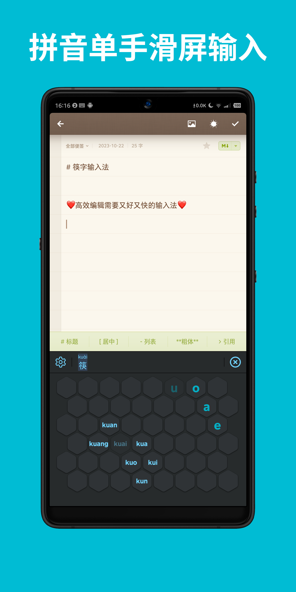
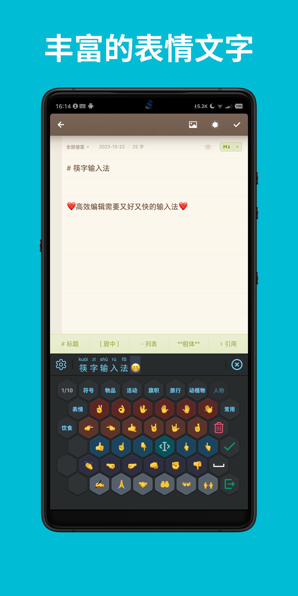
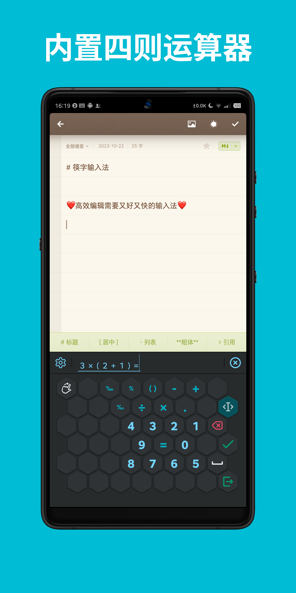
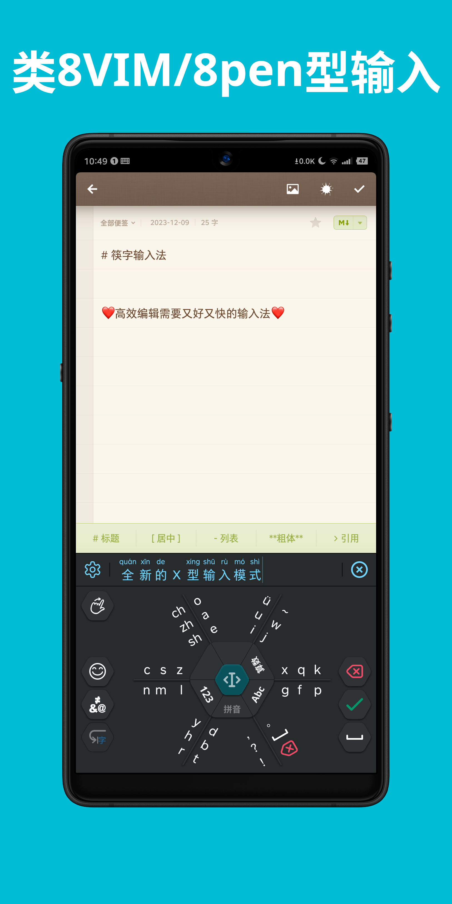

筷字（Kuaizi）输入法
=======================================

中文版 | [English](./README-en.md)


> 下载 Android 版最新版本，请前往 https://github.com/crazydan-studio/kuaizi-ime-android/releases/latest

[](https://f-droid.org/packages/org.crazydan.studio.app.ime.kuaizi)

> **Warning**：筷字输入法目前仅发布在 [F-Droid](https://f-droid.org) 上，并未发布在其他应用平台，
> 请注意识别并警惕相关风险，若需下载使用，请直接点击以上链接。

> 若有缺陷反馈和改进意见，请移步至 [Issues](https://github.com/crazydan-studio/kuaizi-ime/issues)
> 页面。

**筷字输入法** 是一款根据汉语拼音的组合特征而专门设计的、
高效且快速的、适用于电子触屏设备的拼音输入法。

**筷字输入法** 摒弃传统的逐个点击虚拟键盘按键的录入方式，
改为以滑屏方式录入拼音，并结合拼音字母的有限组合特征，精心设计按键布局，
让拼音输入更加准确且便捷。

**筷字输入法** 同时提供对目标编辑器的光标移动和文本选择等编辑支持，
从而彻底摆脱因移动设备屏幕太小而无法准确定位输入和文本位置的烦恼，
进一步提高在小屏设备上的文本输入和编辑效率。

**筷字输入法** 的用户数据仅留存在本地，
其不连接互联网，不会收集和分析用户数据和行为习惯。
其也不支持和提供联想输入和模糊匹配机制，在某种程度上，
该输入法是希望加强用户对汉字和拼音的识别和记忆能力，
不要因为对数字工具的依赖而逐渐遗忘并最终丢弃<b>「汉字」</b>这一中华文明的瑰宝。

## 关于图标

**筷字输入法** 的图标由汉字<b>「字」</b>与中国特色餐具<b>「筷子」</b>组合而成，
该组合将中华文明与其人民独有的饮食文化紧密相连，既展现了中华文明悠久的历史，
也有助于向世界传播中华的传统文化，加深世界友人对中华文化的认识和了解，
同时，也让中华儿女能够对其民族文化拥有更加坚定的自信。

## 仓库克隆

```bash
git clone git@github.com:crazydan-studio/kuaizi-ime.git

cd kuaizi-ime
git submodule update --init android
```

> 具体的构建说明，请详见各模块的 README 文档。

## 工程结构

- [android/](https://github.com/crazydan-studio/kuaizi-ime-android):
  筷字输入法 Android 客户端的完整工程代码。注：使用命令 `git submodule update --init android`
  初始化该 git 子模块
-
- [docs/](./docs/): 本项目的文档目录
  - [十字型输入的交互设计](./docs/design/cross-mode.md): 针对 X 型输入的优化改进方案
- [tools/analyze/](./tools/analyze/):
  拼音按键布局在线分析工具，用于分析拼音的字母组合结构，并验证正六边形按键的布局方案
- [tools/pinyin-dict/](./tools/pinyin-dict/):
  拼音字典数据采集和校正程序，采集汉字数据并生成 SQLite 数据库。筷字输入法客户端的字/词典数据库也由该工具生成
- [thirdparty/](./thirdparty/):
  本项目所使用的第三方字词数据。注：使用命令
  `git submodule update --init thirdparty/OpenCC thirdparty/pinyin-data`
  初始化该目录内的 git 子模块

## License

[Apache 2.0](./LICENSE)

## 友情赞助

**注**：赞助时请添加备注信息 `筷字输入法`。

详细的赞助清单请查看[《友情赞助清单》](./docs/donate/index.md)。

| 支付宝 | 微信支付 |
| -- | -- |
|  |  |

## 待办

- [ ] 以**词组**为单位做词频统计和输入预测

## 功能特性

- 以连续滑屏方式录入拼音，且单次录入最多仅需滑屏两次
- 内置 [8VIM](https://github.com/8VIM/8VIM)/[8pen](./docs/Increasing_the_Efficiency_of_Text_Input_in_the_8pen_Method.pdf)
  输入模式，以画圈方式进行拼音、英文和数字的连续输入，从而提供顺滑的输入体验
- 所有候选字均附带显示完整的拼音，可清晰识别各个字的准确读音
- 输入数据本地存储，不收集、不分析用户数据
- 采用隐马尔科夫模型（Hidden Markov Models）和维特比（Viterbi）算法实现拼音输入预测
- 仅支持精确的拼音输入匹配，**不支持**拼音联想输入和模糊匹配机制
- 提供光标移动、文本选择、复制、粘贴、剪切等编辑功能，
  同时，支持撤回已提交至目标编辑器的输入，以便于对输入进行修正
- 支持左右手模式切换，以适应不同的用户使用习惯
- 支持简单的数学四则运算，可以边输入边计算
- 支持录入标点、表情等文本符号，提供丰富的内容表达形式
- 支持直接输入括号、引号等配对的标点符号，并自动将选中内容包裹在配对符号中
- 在拉丁字符与汉字、操作数与运算符之间自动添加空格，以规范输入格式

https://github.com/user-attachments/assets/c5a3c769-0e6d-42e1-bc2f-babe85607bfb

> Note: 以上音频和字幕由 [GitPodcast](https://www.gitpodcast.com/)
> 生成，最终的视频则是通过 [Veed](https://www.veed.io) 制作而成。

       

## 功能演示

> 最新版本的按键布局可能会与演示视频有差异，请以最新版本的为准。

### 拼音滑屏输入

https://github.com/crazydan-studio/kuaizi-ime/assets/1321315/eb2f74f9-f64e-4d02-ad80-98e3ecb9d61b

### 算术输入

https://github.com/crazydan-studio/kuaizi-ime/assets/1321315/f461b564-0ac4-4257-82ad-11afcd3e1d6c

### 内容编辑

https://github.com/crazydan-studio/kuaizi-ime/assets/1321315/992a0a5e-7e1e-4b93-a1ac-c893d0e3ff2e

### 表情符号匹配

https://github.com/crazydan-studio/kuaizi-ime/assets/1321315/7fff6ddf-9e10-408f-b160-3b3b8e2ab215

### 配对符号输入

https://github.com/crazydan-studio/kuaizi-ime/assets/1321315/97b0f99b-92e1-4b28-a5b6-d45150c4bada

### 拼音输入提交选项

https://github.com/crazydan-studio/kuaizi-ime/assets/1321315/274d41dd-e858-4b71-a041-31df3dd24f7d

### 类 8VIM/8pen 型输入

https://github.com/crazydan-studio/kuaizi-ime/assets/1321315/534fa61e-34dc-4e81-a7d1-5eb7cc3b291f
