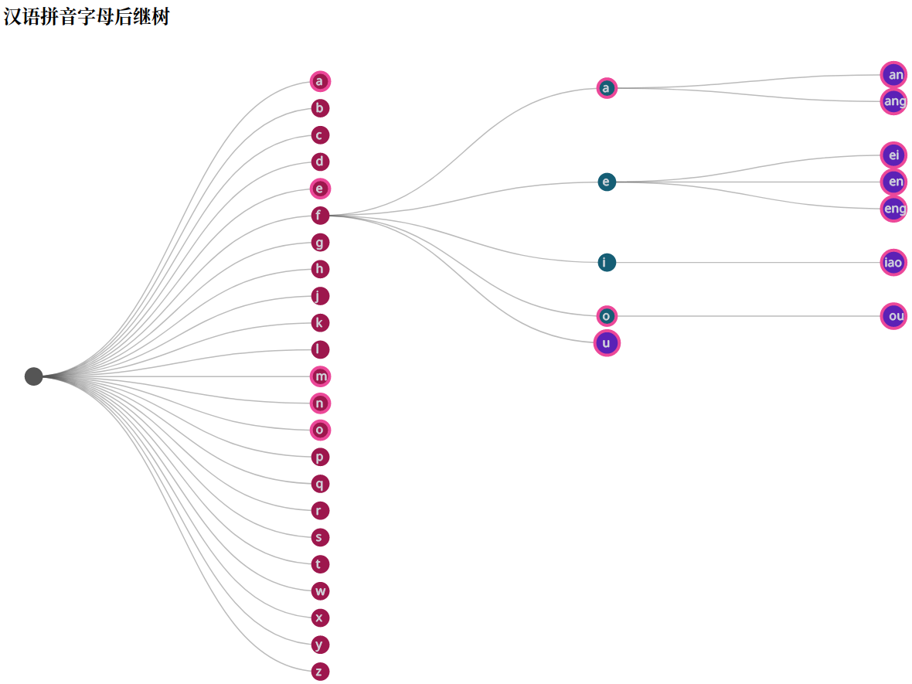
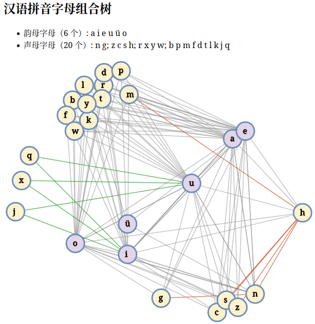

拼音按键布局在线分析工具
==============================

> 本代码改造自
> [Force-Directed Tree](https://observablehq.com/@d3/force-directed-tree@183)
> 和 [Collapsible tree](https://observablehq.com/@d3/collapsible-tree)。

在当前目录中执行命令以启动静态页面服务：

```sh
npx http-server
```

> 需先安装 [NodeJS](https://nodejs.org/)。

## 汉语拼音字母后继树

访问地址 http://127.0.0.1:8080/char-tree.html
以查看拼音的后继字母的树形结构，从而规划出适和滑屏输入的拼音字母的按键布局。

> 代码为 [char-tree.js](./char-tree.js)。



## 汉语拼音字母组合树

访问地址 http://127.0.0.1:8080/char-links.html
以查看拼音字母的组合关系。

> 代码为 [char-links.js](./char-links.js)。



## 汉语拼音划词模拟

访问地址 http://127.0.0.1:8080/simulate.html
以查看规划的按键布局是否符合要求。

> 代码为 [simulate.js](./simulate.js)。


## 外部资料

### 拼音字母统计频率

> - 数据来自于[@軒轅羽](https://www.zhihu.com/question/23111438/answer/559582999)
> - 脚本：`echo $data | sort -r -n -k 2`

| 声母 | 频率 |
| -- | -- |
| d | 10.29% |
| y | 9.69% |
| sh | 8.04% |
| j | 6.86% |
| zh | 6.52% |
| x | 5.86% |
| g | 5.64% |
| l | 4.61% |
| b | 4.49% |
| h | 4.10% |
| z | 3.65% |
| w | 3.26% |
| q | 3.23% |
| ch | 3.02% |
| f | 2.97% |
| m | 2.90% |
| t | 2.79% |
| r | 2.76% |
| n | 2.18% |
| k | 1.85% |
| s | 1.47% |
| p | 1.40% |
| c | 1.27% |

| 单字母韵母 | 频率 |
| -- | -- |
| i | 15.81% |
| e | 10.48% |
| u | 9.08% |
| a | 2.95% |
| o | 0.51% |
| ü | 0.40% |

| 多字母韵母 | 频率 |
| -- | -- |
| ao | 4.04% |
| ai | 3.91% |
| an | 3.78% |
| ang | 3.45% |
| en | 4.02% |
| eng | 3.26% |
| ei | 2.83% |
| er | 0.57% |
| ian | 3.68% |
| ing | 3.68% |
| in | 2.07% |
| iang | 1.57% |
| iao | 1.83% |
| ie | 1.24% |
| ia | 1.18% |
| iu | 1.09% |
| iong | 0.02% |
| ong | 3.83% |
| ou | 3.35% |
| uo | 3.41% |
| uan | 2.73% |
| ui | 2.14% |
| ue | 1.29% |
| un | 0.96% |
| uang | 0.41% |
| ua | 0.35% |
| uai | 0.10% |
| üe | 0.03% |

### 英文字母统计频率

> - 数据来自于[英语单词中首字母的频率](https://zh.wikipedia.org/zh-cn/%E5%AD%97%E6%AF%8D%E9%A2%91%E7%8E%87#.E8.8B.B1.E8.AF.AD.E5.8D.95.E8.AF.8D.E4.B8.AD.E9.A6.96.E5.AD.97.E6.AF.8D.E7.9A.84.E9.A2.91.E7.8E.87)
> - 脚本：`echo $data | sort -r -n -k 2`

| 字母 | 频率 |
| -- | -- |
| t | 16.671% |
| a | 11.602% |
| s | 7.755% |
| h | 7.232% |
| w | 6.753% |
| i | 6.286% |
| o | 6.264% |
| b | 4.702% |
| m | 4.374% |
| f | 3.779% |
| c | 3.511% |
| l | 2.705% |
| d | 2.670% |
| p | 2.545% |
| n | 2.365% |
| e | 2.007% |
| g | 1.950% |
| r | 1.653% |
| y | 1.620% |
| u | 1.487% |
| v | 0.649% |
| j | 0.597% |
| k | 0.590% |
| q | 0.173% |
| x | 0.037% |
| z | 0.034% |
