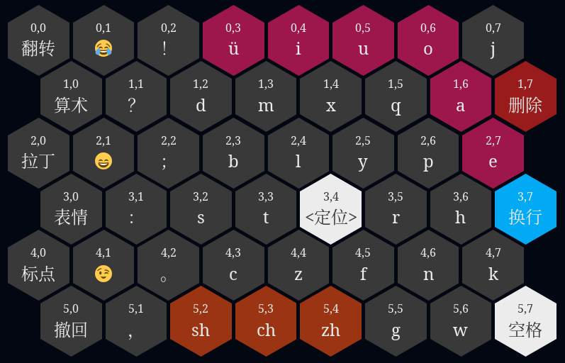

拼音数据分析在线工具
==============================

> 本代码改造自
> [Force-Directed Tree](https://observablehq.com/@d3/force-directed-tree@183)
> 和 [Collapsible tree](https://observablehq.com/@d3/collapsible-tree)。

在当前目录中执行命令以启动静态页面服务：

```sh
npx http-server
```

> 需先安装 [NodeJS](https://nodejs.org/)。

服务启动后，在浏览器中访问地址 http://127.0.0.1:8080/next-char-links.html
以查看拼音的后继字母关联关系，从而规划出适和滑动输入的拼音字母的按键布局。

> 代码为 [next-char-links.js](./next-char-links.js)。


再访问地址 http://127.0.0.1:8080/simulate.html
以查看规划的按键布局是否符合要求。

> 代码为 [simulate.js](./simulate.js)。


