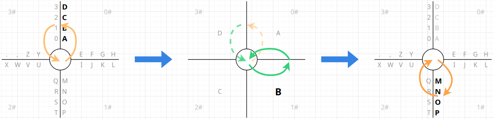
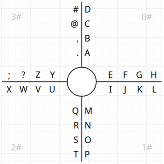
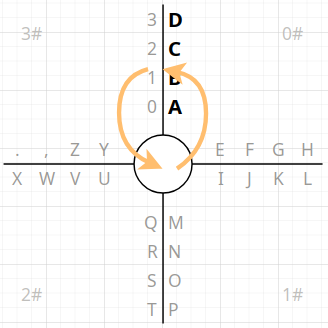
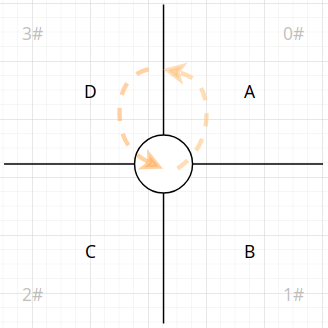
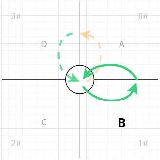
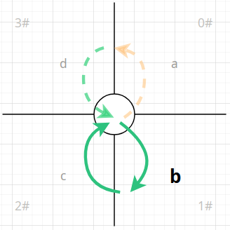
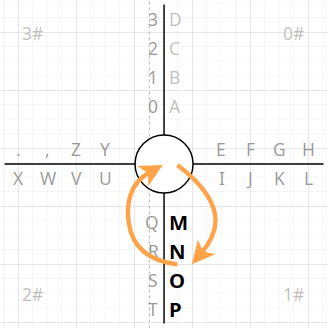
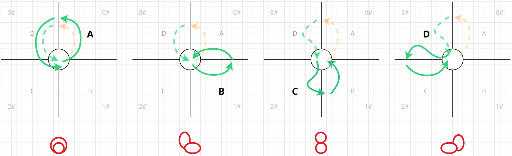
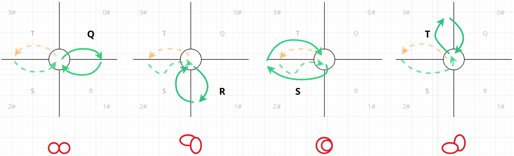
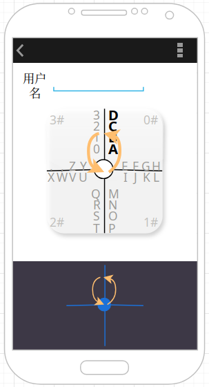

十字型输入的交互设计
========================================

> 十字型输入的交互原型通过 https://app.diagrams.net/ 设计生成，可自行在本地环境载入原稿文件
> [Kuzi_IME_Cross_Mode_Prototype.drawio](./cross-mode/Kuzi_IME_Cross_Mode_Prototype.drawio)
> 以改进或重新设计。

为了能够在触屏设备上提供更加便捷、简洁的汉字输入支持，在综合多位热心网友的反馈意见后，
筷字输入法最终确定了以下几点改进方向（预计在 4.0 版本中实现）：

- 通过滑行方向等**维度**，在确保可唯一定位字符的前提下，让多个字符**共用布局空间**，
  从而增加手指可操作面积，降低误触几率，减轻用户心智负担，提升输入效率。（在
  [#32](https://github.com/crazydan-studio/kuaizi-ime/issues/32)
  中由 [@LoongVeeng](https://github.com/LoongVeeng) 反馈提出）
- 保证滑行输入的连贯性和连续性，做到「一气呵成」、「一笔成画」，
  使得输入过程更加顺滑、自然、流畅。（在
  [#1](https://github.com/crazydan-studio/kuaizi-ime/issues/1)
  和 [#32](https://github.com/crazydan-studio/kuaizi-ime/issues/32)
  中分别由 [@Vinfall](https://github.com/Vinfall)
  和 [@LoongVeeng](https://github.com/LoongVeeng) 反馈提出）
- 确保能够形成**固定**的滑行轨迹，只要滑行形成的轨迹匹配（方向+形状），便可完成输入，
  不需要等待字符布局的更新，也不用视线始终留在屏幕上，从而为**盲打**提供支持。（在
  [#32](https://github.com/crazydan-studio/kuaizi-ime/issues/32)
  中由 [@LoongVeeng](https://github.com/LoongVeeng) 反馈提出）
- 支持双拼/简拼输入，内置多种映射方案，从而减少拼音输入的滑行次数和距离，
  以满足更注重输入速度的用户的需求。（在
  [#8](https://github.com/crazydan-studio/kuaizi-ime/issues/8)、
  [#3](https://github.com/crazydan-studio/kuaizi-ime/issues/3) 中由多位网友反馈提出）

> 注：剪贴和剪贴板管理，将在 3.x 版本中完成，并延续到后面的版本，因此，不在本设计的讨论范围内。

注意，由于最后一项功能并不影响输入的交互逻辑，因此，本设计将主要针对前面三项改进进行深入说明。

结合以上需求，并对以下参考案例进行分析，再整合筷字输入法的交互模式后：

- [8VIM](https://github.com/8VIM/8VIM)/[8pen](../Increasing_the_Efficiency_of_Text_Input_in_the_8pen_Method.pdf)：
  由 [@Vinfall](https://github.com/Vinfall) 提供
- [手心输入法](https://github.com/crazydan-studio/kuaizi-ime/issues/32#issuecomment-2668010138)：
  由 [@LoongVeeng](https://github.com/LoongVeeng) 提供
- [虾滑输入法](https://github.com/crazydan-studio/kuaizi-ime/issues/1#issuecomment-2636091392)：
  由 [@sgzman](https://github.com/sgzman) 提供

最终得到如下形式的交互设计原型：



> 注：该图仅作为演示说明，实际的按键布局会综合使用频率、使用习惯、操作便捷性等因素进行优化调整。

也就是，我们将会在一个「十」字形面板上进行输入交互，因此，本设计将该输入模式称为**十字型输入**。

## X 型输入

可以发现，十字型输入在本质上是从
[8VIM](https://github.com/8VIM/8VIM)/[8pen](../Increasing_the_Efficiency_of_Text_Input_in_the_8pen_Method.pdf)
的 **X 型输入**模式上发展而来的。

> 注：筷字输入法 3.x 版本也内置了一版 X 型输入的变体，但其交互逻辑并没有脱离 X 型输入模式，
> 因此，其将在 4.0 中被十字型输入替代。

以下为 X 型输入的操作示意图，其中，左侧为输入字符 `Q`，右侧为输入字符 `O`：


> 注：图源来自于 8pen 论文。

X 型输入的字符布局规则如下：

- 通过两条 X 形的交叉线，将输入面板均分为四个区域，这些区域作为定位输入字符的第一个维度，
  我们称之为布局的**第一维度**
- 两条交叉线，形成四条轴，每条轴有两个侧面，在每个侧面都可放置最多四个字符，
  我们称这些轴线为布局的**第二维度**
- 经过两个维度的布局，在 X 型输入中，可以最多放置 `4（个区域）x 2（个轴侧面）x 4（个字符）= 32`
  个字符

而其输入逻辑如下（以上图中的字符 `O` 的输入为例）：

- 从中心原点出发，滑入字符 `O` 所在区域
- 沿逆时针方向，依次滑入左侧和下方两个区域
- 再从下方区域滑回中心原点，完成对 `O` 的输入
- 而手指滑过的区域数，对应的便是字符在轴上的序号（从 `1` 开始）位置
- 只有滑回中心原点，才表示一个字符输入的结束

下面是 8VIM 的输入演示视频，可以更直观地理解以上输入过程：

https://github.com/user-attachments/assets/3b5f2503-4852-4678-acd8-6f599eb523cd

可以发现，X 型输入具备以下优点：

- 通过两个维度（**空间位置** + **滑行方向**）布局和定位字符，在保证输入字符全部可见的前提下，
  使得操作空间更大，而且输入也会更精准
- 通过画圈来定位输入字符，使得手指可以在固定范围内完成输入，而不会出现跨越整个屏幕宽度的手指移动问题
- 多个字符可以连续输入，手指不用离开屏幕，对常用单词，比较容易形成固定的输入轨迹，
  从而不假思索地快速完成输入

但该输入模式存在的最大问题是，无法形成具备**唯一性**的滑行轨迹形状。
因为，通过画圈时经过的区域数量来定位相应位置的字符，其形成的滑行轨迹都只是不同角度的圆弧，
如果视线脱离屏幕，仅凭感觉是难以保证输入的准确性的。

并且，不同位置的字符，其滑行的弧度有大有小，即便是可连续输入，但在输入另一个不同位置的字符时，
也不得不短暂思考一下手指需要滑过几个区域。

另外就是其字符布局是静态的，从而限制了其更进一步的发展，比如，对拼音输入的支持便不是很方便。

## 十字型输入



十字型输入依然是通过四条轴将输入面板均分为四个区域，只是四条轴是在水平和垂直方向进行交叉的，
构成一个「十」字，而不像 X 型输入是做了 45 度旋转，形成的是一个 `X`。

为方便说明该模式的输入过程，这里将均分的四个区域沿顺时针方向依次标注为
`0#`、`1#`、`2#` 和 `3#`，同样地，这四个区域为十字型输入布局的**第一维度**。
而在轴向两侧也各放置四个字符，并且也称这些轴线为布局的**第二维度**。

下面以输入字符 `B` 为例，说明十字型输入的字符**动态布局**机制，及其交互逻辑。

**第一步**：从中心原点出发滑入字符 `B` 所在的 `0#` 区域，接着，沿逆时针方向滑入 `3#`
区域，并滑回到中心原点：



这一步的操作结果是激活并展开**第二维度**上的字符，即上图中的 `A`、`B`、`C`、`D`。

> 注：若是最终依然从 `0#` 区域滑回中心原点，则表示取消对 `0#`
> 区域的字符选择，需重新选择其他输入字符的区域。

由于在第二维度中最多只有四个字符，故而，正好可以将其全部展开并分别放置在第一维度的四个区域中，
实现对第二维度字符的动态布局：



> 注：第二维度字符的展开规则（即，从哪个区域向哪个方向展开）还需后续研究确定。

**第二步**：继续从中心原点滑入字符 `B` 所在的 `1#` 区域，此时，在第二维度的字符展开后，
每个字符均独占一个区域，而在区域内滑行又有逆时针和顺时针两个方向可以选择，
这正好可以用于区分字符的大小写两种形式。因此，这里暂且规定，若从 `1#`
区域逆时针方向滑入 `0#` 区域并滑回中心原点，则输入大写字符 `B`，
而若沿顺时针方向从 `1#` 区域滑入 `2#` 区域再滑回中心原点，则输入小写字符 `b`：

- 逆时针输入字符的大写形式

  

- 顺时针输入字符的小写形式

  

> 注：若是最终依然从 `1#` 区域滑回中心原点，则表示取消对字符 `B` 的选择，可重新选择其他字符。

至此，通过两步滑行，便可唯一确定大写或小写形式的字符 `B`。

在完成字符的输入后，输入面板将自动恢复到初始布局。这样便无需中断滑行，
可继续从中心原点滑入目标输入字符所在的区域（比如 `1#`），并按照上述过程输入其他字符即可：



若是对所有字符的输入轨迹进行分析，在不考虑滑行方向的情况下，可以得到以下形状：

- 垂直方向（逆时针输入大写字符）

  

- 水平方向（顺时针输入小写字符）

  

从中可以发现十字型输入的以下特点：

- 每个字符需要且仅需要两次滑行便可完成输入
- 每个字符的滑行轨迹都是数字 `8` 或其变形后的形状，而对 `8`
  的变形是通过重新堆叠其两个 `o` 实现的
- 通过以水平、垂直、重叠形式堆叠两个 `o`，以及沿轨迹滑行的运动方向，
  可以唯一确定全部输入字符

之所以采用「十」字形输入，而非「X」形，其主要原因就是，十字形更便于分析
`8` 及其变形的轨迹形状，而若是要分析在「X」上形成的轨迹，则相对会更复杂一点。
最重要的是，在水平或垂直方向上滑行，会比在倾斜方向上滑行，更加方便和准确。

可以说，**十字型输入** + **字符动态布局**是目前最能够满足本设计最开始所提出的几点要求的方案。

而对于盲打的输入支持，可以详见章节[《盲打输入模式》](#盲打输入模式)。

### 拼音输入模式

- 根据拼音组合的特点，对其字母组合进行合适的拆分再动态布局，以最小的滑行次数完成输入
- 将拼音的声母作为第一级布局，再将声母之后仅有的韵母进行拆分
- 布局的韵母最好能够滑行一次便完成输入，所以，优先将其放置在布局的第一维度中，
  再配合滑行方向确定或展开韵母的其他组合

```log
n |27| n,ng, na,nai,nan,nao,nang, ne,nei,nen,neng, ni,nie,nin,niu,nian,niao,ning,niang, nou,nong, nu,nun,nuo,nuan, nü,nüe

=> 布局的第一维度：[ni:1, ni*:7], [ng:1, na*:5], [ne*:4, nu*:4], [no*:2, nü*:2]
=> 注：去掉 n，其与 ng 对应的字相同，且 ng 的读音更多

l |26| la,lai,lan,lao,lang, le,lei,leng, li,lia,lie,lin,liu,lian,liao,ling,liang, lo,lou,long, lu,lun,luo,luan, lü,lüe

=> 布局的第一维度：[la:1, la*:4], [li:1, li*:8], [le:3, lo:3], [lu:4, lü:2]

d |23| da,dai,dan,dao,dang, de,dei,den,deng, di,dia,die,diu,dian,diao,ding, dou,dong, du,dui,dun,duo,duan

=> 布局的第一维度：[da:1, da*:4], [di:1, di*:6], [de*:4, do*:2], [du:1, du*:4]

h |21| hm,hng, ha,hai,han,hao,hang, he,hei,hen,heng, hou,hong, hu,hua,hui,hun,huo,huai,huan,huang

=> 布局的第一维度：[hm:1, hn:1], [ha:1, ha*:4], [he*:4, ho*:2], [hu:1, hu*:7]

m |20| m, ma,mai,man,mao,mang, me,mei,men,meng, mi,mie,min,miu,mian,miao,ming, mo,mou, mu

=> 布局的第一维度：[m:1, mu:1], [ma:1, ma*:4], [mi:1, mi*:6], [me*:5, mo*:2]
```

### 盲打输入模式

盲打输入会对使用者提出以下要求：

- 需在大脑中记住初始布局，再根据动态布局的规则，在输入过程中，快速绘制出展开后的字符布局
- 快速确定出「从初始布局到完成字符输入」所形成的滑行轨迹和运动方向
- 协调手指做出响应，从键盘输入区域的任意位置开始，沿着大脑确定出的滑行轨迹和运动方向，迅速滑出字符的输入轨迹
- 回到第一步，按照相同步骤，继续下一个字符的输入，直到输入全部完成

> 注：只需要记住动态布局的规则，并不需要记住每个字符的布局位置。

当然，盲打输入也不是一蹴而就的，需要一个适应过程，为此，特地为十字型输入设置了一个「面板投屏」模式。
也就是，在键盘上方的屏幕空间显示一个半透明的、浮动于文本输入之上的十字型输入面板，
其将根据在键盘上的滑行手势同步显示/更新字符布局：



> - 键盘中的「十」字仅用于表示当前为十字型输入，实际的滑行可从任意位置开始；
> - 全屏的十字型输入面板不是一直显示的，仅在开始滑行时才出现，并在滑行结束后，自动消失；

这样，便可逐渐让视线脱离输入键盘，最终实现滑屏的盲打输入。

> 注：「面板投屏」方案的灵感来源为
> [虾滑输入法](https://github.com/crazydan-studio/kuaizi-ime/issues/1#issuecomment-2636091392)。

### 其他

- 可在四个字符区域各放置一到两个功能按键
- 如何自然地切换到数字、算术等输入键盘？
- 拼音候选字、表情、符号等输入字符过多，依然采用按键输入模式，不考虑滑行输入，
  但可以考虑在滑行输入的初始布局的空位中放置常用的表情和符号
- 由于字符输入的路径长度相同，因此，在初始布局中无需考虑字符的高频性，
  直接以最简单的规则（比如，按字母顺序）布局字符即可
  - 但对第二维度的字符展开后，则需要考虑以更顺滑的轨迹（不出现逆拐）完成对高频字符的输入
- 英文补全内容（输入补全）、拼音高频字（候选字）均以气泡形式展示在键盘上方并自带序号
  - 如何在输入过程中，通过滑屏手势平滑地根据序号选中输入补全或候选字？
  - 也可以不选择，所以，不能干扰正常的字符输入过程，避免在输入间隙强制插入「输入选择」过程
- 可否支持通过滑屏手势，对输入列表中的输入做选择和删除？
  - 在选中输入后释放手指，则自动进入输入修改或拼音候选字选择模式
