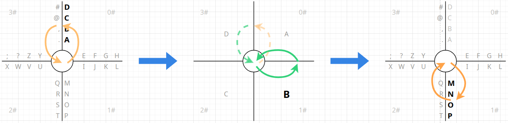
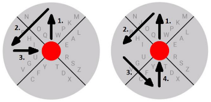
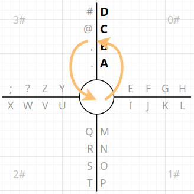
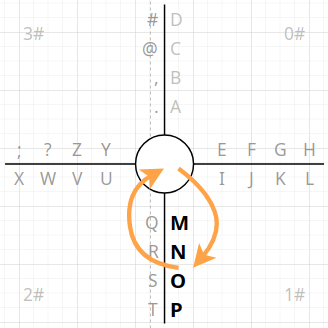
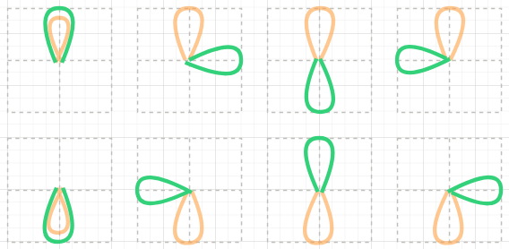
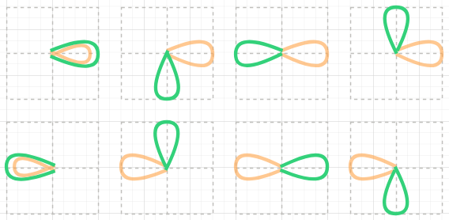
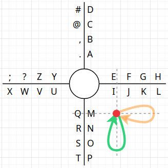

十字型输入的交互设计
========================================

> 十字型输入的交互原型通过 https://app.diagrams.net/ 设计生成，可自行在本地环境载入原稿文件
> [Kuzi_IME_Cross_Mode_Prototype.drawio](./cross-mode/Kuzi_IME_Cross_Mode_Prototype.drawio)
> 以改进或重新设计。

为了能够在触屏设备上提供更加便捷、简洁的汉字输入支持，在综合多位热心网友的反馈意见后，
筷字输入法最终确定了以下几点改进方向（预计在 4.0 版本中实现）：

- 通过滑行方向等**维度**，在确保可唯一定位字符的前提下，让多个字符**共用布局空间**，
  从而增加手指可操作面积，降低误触几率，减轻用户心智负担，提升输入效率。（在
  [#32](https://github.com/crazydan-studio/kuaizi-ime/issues/32)
  中由 [@LoongVeeng](https://github.com/LoongVeeng) 反馈提出）
- 保证滑行输入的连贯性和连续性，做到「一气呵成」、「一笔成画」，
  使得输入过程更加顺滑、自然、流畅。（在
  [#1](https://github.com/crazydan-studio/kuaizi-ime/issues/1)
  和 [#32](https://github.com/crazydan-studio/kuaizi-ime/issues/32)
  中分别由 [@Vinfall](https://github.com/Vinfall)
  和 [@LoongVeeng](https://github.com/LoongVeeng) 反馈提出）
- 确保能够形成**固定**的滑行轨迹，只要滑行形成的轨迹匹配（方向+形状），便可完成输入，
  不需要等待字符布局的更新，也不用视线始终留在屏幕上，从而为**盲打**提供支持。（在
  [#32](https://github.com/crazydan-studio/kuaizi-ime/issues/32)
  中由 [@LoongVeeng](https://github.com/LoongVeeng) 反馈提出）
- 支持双拼/简拼输入，内置多种映射方案，从而减少拼音输入的滑行次数和距离，
  以满足更注重输入速度的用户的需求。（在
  [#8](https://github.com/crazydan-studio/kuaizi-ime/issues/8)、
  [#3](https://github.com/crazydan-studio/kuaizi-ime/issues/3) 中由多位网友反馈提出）

> 注：剪贴和剪贴板管理，将在 3.x 版本中完成，并延续到后面的版本，因此，不在本设计的讨论范围内。

注意，由于最后一项功能并不影响输入的交互逻辑，因此，本设计将主要针对前面三项改进进行深入说明。

结合以上需求，并对以下参考案例进行分析，再整合筷字输入法的交互模式后：

- [8VIM](https://github.com/8VIM/8VIM)/[8pen](../Increasing_the_Efficiency_of_Text_Input_in_the_8pen_Method.pdf)：
  由 [@Vinfall](https://github.com/Vinfall) 提供
- [手心输入法](https://github.com/crazydan-studio/kuaizi-ime/issues/32#issuecomment-2668010138)：
  由 [@LoongVeeng](https://github.com/LoongVeeng) 提供
- [虾滑输入法](https://github.com/crazydan-studio/kuaizi-ime/issues/1#issuecomment-2636091392)：
  由 [@sgzman](https://github.com/sgzman) 提供

最终得到如下形式的交互设计原型：



也就是，我们将会在一个「十」字形面板上进行输入交互，因此，本设计将该输入模式称为**十字型输入**。

## X 型输入

很明显，十字型输入是从
[8VIM](https://github.com/8VIM/8VIM)/[8pen](../Increasing_the_Efficiency_of_Text_Input_in_the_8pen_Method.pdf)
的 **X 型输入**模式发展而来的。

> 注：筷字输入法 3.x 版本也内置了一版 X 型输入的变体，但其交互逻辑并没有脱离 X 型输入模式，
> 因此，其将在 4.0 中被十字型输入替代。

以下为 X 型输入的操作示意图，其中，左侧表示对字符 `Q` 的输入，右侧表示对字符 `O` 的输入：



> 注：图源来自于 8pen 论文。

X 型输入的字符布局规则如下：

- 通过两条 X 形的交叉线，将输入面板均分为四个区，输入字符将会被分配到这些`分区`（`Zone`）中
- 分区与交叉线相交的两条边相互垂直，分配到该分区的字符将被进一步分配到两个侧边上
- 交叉线从中心向外辐射，形成**辐射轴**，再沿轴的辐射方向，依次放置分配到侧边上的字符，
  且最多可放置四个字符
- 经过 `(分区, 分区侧边, 轴序号)` 三个维度的布局，在 X 型输入中，可以最多放置
  `4（个分区）x 2（条分区侧边）x 4（个轴向字符）= 32` 个字符

而其输入逻辑如下（以上图中的字符 `O` 的输入为例，并将四个分区按位置命名为上、下、左、右分区）：

- 从中心红点出发，滑入字符 `O` 所在的`上分区`。这表示激活对该分区字符的选择
- 由于 `O` 在分区的左侧边上，因此，需沿逆时针方向，滑入`左分区`。这表示选择`上分区`左侧边的字符
- 继续保持滑行方向不变，滑入`下分区`，并直接滑回中心红点。这表示选择沿轴辐射方向上的第二个字符，
  也就是当前所要输入的字符 `O`
- 其中，手指滑过的分区数量，对应的便是字符在辐射轴上的位置，
  并且，只有滑回中心红点，才表示一个字符输入过程的结束

下面是 8VIM 的输入演示视频，可以更直观地理解以上输入过程：

https://github.com/user-attachments/assets/3b5f2503-4852-4678-acd8-6f599eb523cd

可以发现，X 型输入具备以下优点：

- 充分利用分区、分区侧边、轴的辐射方向三个**空间维度**来**布局字符**，在保证输入字符全部可见的前提下，
  使得操作空间更大
- 通过滑行运动方向和经过的分区数量的方式**定位字符**，充分利用**运动维度**，
  实现了对目标输入的精准定位
- 通过画圈来定位输入字符，使得手指可以在固定范围内完成输入，而不会出现跨越整个屏幕宽度的手指移动问题
- 多个字符可以连续输入，手指不用离开屏幕，对常用单词，比较容易形成固定的输入轨迹，
  从而快速完成输入
- 其最大可输入字符数与其布局可放置的最大字符数相等（均为 `32` 个字符）

但该输入模式存在的最大问题是，无法形成具备**唯一性**的输入轨迹形状。
因为，通过画圈时经过的分区数量来定位相应位置的字符，其形成的输入轨迹都只是不同角度的圆弧，
如果视线脱离屏幕，仅凭感觉是难以保证输入的准确性的。

并且，不同位置的字符，其滑行的弧度有大有小，即便是可连续输入，但在输入另一个不同位置的字符时，
也不得不短暂思考一下手指需要滑过几个分区，从而影响整体输入的效率和连贯性。

虽然 8VIM 也支持动态布局，但其依然采用画圈模式来做切换，也即，在小写输入模式下，
画一个圆周便会激活大写输入模式，然后，依然按滑过的分区数来定位辐射轴上的大写字符：


这将导致在输入大写字符时，完全无法靠感觉操作了，并且也使得手指需要滑行的距离增大，
输入效率势必受到很大影响。

## 十字型输入


> 注：这里的字符布局规则为，从 `0#` 分区开始，沿顺时针方向，并按字母表顺序，
> 依次向分区的左/右两侧各放置四个字符，直到字符全部放置完毕。

十字型输入依然是通过四条轴将输入面板均分为四个分区，只是四条轴是在水平和垂直方向进行交叉的，
构成一个「十」字，而不像 X 型输入是做了 45° 旋转，形成的是一个 `X`。

为方便说明该模式的输入过程，这里将均分的四个分区沿顺时针方向依次标注为
`0#`、`1#`、`2#` 和 `3#`，同样地，
可输入的字符被依次按分区、分区侧边、辐射轴三个维度进行放置。

下面以输入字符 `B` 为例，说明十字型输入的字符输入逻辑。

**第一步**：选中目标输入字符所在分区的侧边。
即，从中心点出发滑入字符 `B` 所在的 `0#` 分区，接着，沿逆时针方向滑入 `3#`
分区，再滑回到中心点：



> 注：若是最终依然从 `0#` 分区滑回中心点，则表示取消对该分区字符的选择，
> 可重新选择其他输入字符所在的分区。

在选中分区侧边后，十字型输入将通过**动态布局**把分区侧边上的（最多）四个字符重新布局到四个分区中。
也就是，对侧边上排列的字符做**布局展开**：


> 注：这里的布局展开规则为，从 `0#` 分区开始，沿顺时针方向依次向各个分区放置字符。

**第二步**：选择目标输入字符。即，继续从中心点滑入在布局展开后的字符 `B` 所在的 `1#` 分区。
此时，由于每个字符均独占一个分区，而在分区内滑行又有逆时针和顺时针两个方向可以选择，
这正好可以用于区分字符的大小写两种形式。因此，这里暂且规定，若从 `1#`
分区逆时针方向滑入 `0#` 分区并滑回中心点，则输入大写字符 `B`，
而若沿顺时针方向从 `1#` 分区滑入 `2#` 分区再滑回中心点，则输入小写字符
`b`（其本质就是，在分区的左侧边放置字符大写的形式，在分区右侧边放置字符的小写形式）：

- 逆时针输入字符的大写形式

  

- 顺时针输入字符的小写形式

  

> 注：若是最终依然从 `1#` 分区滑回中心点，则表示取消对字符 `B` 的选择，可重新选择其他字符。

至此，通过两步滑行，便可唯一确定大写或小写形式的字符 `B`。

在完成字符的输入后，输入面板将自动恢复到初始布局。因此，无需中断滑行，
可继续从中心点滑入目标输入字符所在的分区（比如 `1#`），并按照上述过程输入其他字符即可：



也就是，在十字型输入中，字符的定位坐标为 `(分区, 分区侧边, 分区, 分区侧边)`，
与 X 型输入相比，其不再利用轴序号，而是通过动态布局，连续使用两次分区及其侧边，
这使得十字型输入的最大可输入字符数变为
`4（个分区） * 2（条分区侧边） * 4（个轴向字符） * 2（个形式变换） = 64` 个。

若是对所有字符的输入轨迹进行分析，在不考虑滑行方向的情况下，可以得到以下形状的轨迹图：

- 第一步滑行轨迹（橙色曲线）在垂直方向时

  

- 第一步滑行轨迹（橙色曲线）在水平方向时

  

从中可以发现十字型输入的以下特点：

- 每个字符均需要且仅需要两次滑行才能完成输入
- 两次滑行均需以固定的位置作为起止点：本设计将其称为**轨迹原点**，
  在轨迹原点半径范围内的滑入滑出均视为滑行轨迹的有效起止点
- 每次滑行形成的轨迹都是一个椭圆形状，并且以十字型输入的辐射轴为椭圆的长轴
- 两个椭圆形会以水平、垂直或重叠的形式组成字符的输入轨迹
- 通过两个椭圆轨迹的不同组合，以及在椭圆上的滑行方向（顺时针或逆时针），便可唯一确定每个输入字符
- 每个字符的轨迹都是相似的，滑行次数也是相同的，故其相互之间没有优劣之分，
  因此，不需要按照使用频率等因素来确定字符的布局，直接按字母顺序沿顺时针方向依次放置即可

若是在输入轨迹上加上运动方向，则可以发现，输入轨迹中的两个椭圆也是具有**方向性**的，
且从轨迹原点出发，仅有顺时针和逆时针两个方向。因此，我们可以用以下两个箭头代表不同方向的椭圆：

- 背离轨迹原点的箭头：其箭头从原点指向外部，用以表示沿逆时针方向滑行的椭圆
- 指向轨迹原点的箭头：其箭头从外部指向原点，用以表示沿顺时针方向滑行的椭圆

这样，便可以得到如下图所示的输入轨迹与箭头的映射关系（仅列举部分）：

- 逆时针输入轨迹与箭头（橙色为第一步轨迹，绿色为第二步轨迹）

  

- 顺时针输入轨迹与箭头（橙色为第一步轨迹，绿色为第二步轨迹）

  

之所以将椭圆轨迹简化为箭头，是因为，椭圆轨迹是一条曲线，由多个点组成，
而箭头本质是一个向量，仅需要两个点便可确定。并且，从椭圆简化为向量的过程也很简单，只需要：

- 以轨迹原点为中心，绘制横纵坐标轴，即，一个「十」字
- 椭圆轨迹与坐标轴相交的点便为其长轴的端点：共两个，其中一个为轨迹原点
- 椭圆轨迹长轴的端点便是其对应向量的起止点
- 分析椭圆轨迹上点的运动方向，便可确定椭圆方向，进而确定向量方向，最终完成转换

沿横纵坐标有 `4` 个位置，每个位置有 `4` 种轨迹组合，每个组合包含 `2` 个向量，
每个向量又有 `2` 个方向，所以，通过向量总共可以表达 `4 * 4 * 2 * 2 = 64` 个输入轨迹，
正好与十字型输入的最大可输入字符数（`64`）相等，进一步证明将椭圆轨迹转换为向量是可行的。

需要特别注意的是，从向量不能等效转换为可识别的输入轨迹，
因为，通过直线无法确定滑行轨迹是顺时针还是逆时针方向。因此，在实际滑行时，不能来回画直线，
在来回的两条线之间必须要有一定的间隔，不能重叠，也就是椭圆的短轴长度不能小于某个值。

在确定了从椭圆轨迹到向量的转化规则后，字符输入便可摆脱布局的空间限制，可以以任意点作为轨迹原点，
只要滑行轨迹能够正确转换为水平或垂直方向上的向量即可。

下图表示的是从非中心位置开始的字符输入轨迹，其对应的是小写字符 `f`
的输入（橙色曲线为第一步轨迹，绿色曲线为第二步轨迹）：



> 注：对于盲打的输入支持，可以详见章节[《盲打输入模式》](#盲打输入模式)。

从以上分析不难看出，在十字形上的滑行轨迹更便于实现轨迹识别，其仅涉及垂直和水平两个方向，而在
X 形上则需要做 45° 旋转处理。更重要的是，围绕十字形的轴线画椭圆仅需较小的**分区跨度**即可，
也就是，椭圆轨迹的短轴可以很短，但在 X 形上滑行的椭圆轨迹的短轴则相对要更长一些。

因此，本设计选择十字形布局并不是为了与 X 形布局做区分，而是十字型输入会比
X 型输入更方便、更省力、更准确。

### 拼音输入模式

- 根据拼音组合的特点，对其字母组合进行合适的拆分再动态布局，以最小的滑行次数完成输入
- 将拼音的声母作为第一级布局，再将声母之后仅有的韵母进行拆分
- 布局的韵母最好能够滑行一次便完成输入，所以，优先将其放置在布局的第一维度中，
  再配合滑行方向确定或展开韵母的其他组合

```log
n |27| n,ng, na,nai,nan,nao,nang, ne,nei,nen,neng, ni,nie,nin,niu,nian,niao,ning,niang, nou,nong, nu,nun,nuo,nuan, nü,nüe

=> 布局的第一维度：[ni:1, ni*:7], [ng:1, na*:5], [ne*:4, nu*:4], [no*:2, nü*:2]
=> 注：去掉 n，其与 ng 对应的字相同，且 ng 的读音更多

l |26| la,lai,lan,lao,lang, le,lei,leng, li,lia,lie,lin,liu,lian,liao,ling,liang, lo,lou,long, lu,lun,luo,luan, lü,lüe

=> 布局的第一维度：[la:1, la*:4], [li:1, li*:8], [le:3, lo:3], [lu:4, lü:2]

d |23| da,dai,dan,dao,dang, de,dei,den,deng, di,dia,die,diu,dian,diao,ding, dou,dong, du,dui,dun,duo,duan

=> 布局的第一维度：[da:1, da*:4], [di:1, di*:6], [de*:4, do*:2], [du:1, du*:4]

h |21| hm,hng, ha,hai,han,hao,hang, he,hei,hen,heng, hou,hong, hu,hua,hui,hun,huo,huai,huan,huang

=> 布局的第一维度：[hm:1, hn:1], [ha:1, ha*:4], [he*:4, ho*:2], [hu:1, hu*:7]

m |20| m, ma,mai,man,mao,mang, me,mei,men,meng, mi,mie,min,miu,mian,miao,ming, mo,mou, mu

=> 布局的第一维度：[m:1, mu:1], [ma:1, ma*:4], [mi:1, mi*:6], [me*:5, mo*:2]
```

### 盲打输入模式

盲打输入会对使用者提出以下要求：

- 需在大脑中记住初始布局，再根据动态布局的规则，在输入过程中，快速绘制出展开后的字符布局
- 快速确定出「从初始布局到完成字符输入」所形成的输入轨迹和运动方向
- 协调手指做出响应，从键盘输入分区的任意位置开始，沿着大脑确定出的输入轨迹和运动方向，迅速滑出字符的输入轨迹
- 回到第一步，按照相同步骤，继续下一个字符的输入，直到输入全部完成

> 注：只需要记住动态布局的规则，并不需要记住每个字符的布局位置。

当然，盲打输入也不是一蹴而就的，需要一个适应过程，为此，特地为十字型输入设置了一个「面板投屏」模式。
也就是，在键盘上方的屏幕空间显示一个半透明的、浮动于文本输入之上的十字型输入面板，
其将根据在键盘上的滑行手势同步显示/更新字符布局：


> - 键盘中的「十」字仅用于表示当前为十字型输入，实际的滑行可从任意位置开始；
> - 全屏的十字型输入面板不是一直显示的，仅在开始滑行时才出现，并在滑行结束后，自动消失；

这样，便可逐渐让视线脱离输入键盘，最终实现滑屏的盲打输入。

> 注：「面板投屏」方案的灵感来源为
> [虾滑输入法](https://github.com/crazydan-studio/kuaizi-ime/issues/1#issuecomment-2636091392)。

**开个小差**：既然有「面板投屏」了，那么就可以内置一些滑屏类小游戏，比如，贪吃蛇、吃豆人等，
作为放松娱乐之用 ;-)。

### 其他

- 可在四个字符分区各放置一到两个功能按键
- 如何自然地切换到数字、算术等输入键盘？
  - 在轨迹原点画圈，类似于拨动旋钮，根据画圈的数量来循环切换不同的输入
    - 模拟阻尼滚轮拨动
  - 符号、表情等，仅放置常用的，更多的选择，需点击切换按键再做选择
- 拼音候选字、表情、符号等输入字符过多，依然采用按键输入模式，不考虑滑行输入，
  但可以考虑在滑行输入的初始布局的空位中放置常用的表情和符号
- 英文补全内容（输入补全）、拼音高频字（候选字）均以气泡形式展示在键盘上方并自带序号
  - 如何在输入过程中，通过滑屏手势平滑地根据序号选中输入补全或候选字？
  - 也可以不选择，所以，不能干扰正常的字符输入过程，避免在输入间隙强制插入「输入选择」过程
  - 英文补全可以在滑行完成第一个椭圆轨迹时进行选择，
    此时，通过在原点上画圈的方式对输入补全做选择，画圈的数量决定选中第几个补全，
    且一旦开始画圈，字符布局便恢复初始布局，可直接选中补全并开始新的输入
    - 第一次滑行可用于确定当前已输入的可选后继字符，以便于基于此确定待补全的内容
- 可否支持通过滑屏手势，对输入列表中的输入做选择和删除？
  - 在选中输入后释放手指，则自动进入输入修改或拼音候选字选择模式
