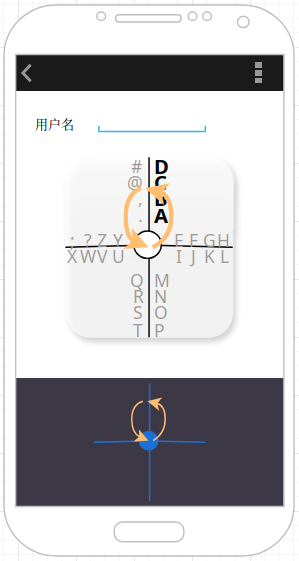

十字型输入的交互设计
========================================

> 十字型输入的交互原型通过 https://app.diagrams.net/ 设计生成，可自行在本地环境载入原稿文件
> [Kuzi_IME_Cross_Mode_Prototype.drawio](./cross-mode/Kuzi_IME_Cross_Mode_Prototype.drawio)
> 以改进或重新设计。

筷字输入法的**十字型输入**在本质上是基于
[8VIM](https://github.com/8VIM/8VIM)/[8pen](../Increasing_the_Efficiency_of_Text_Input_in_the_8pen_Method.pdf)
的 X 型输入的优化改进方案。

以下为 8pen 的 X 型输入示意图，左图为输入字符 `Q`，右图为输入字符 `O`（注：图例来自于 8pen 论文）：

8VIM/8pen 的 X 型输入模式如下：

- 通过两条交叉成 `X` 形状的轴线将输入区域划分为四个字符区域，
  并在四条**辐射轴**的两侧分别放置输入字符（可以为字母、数字、符号等）
- 在输入时，手指从中心原点出发，**滑入**目标字符（比如，上图中的 `O`）所在的区域，然后，
  再向 `O` 所在的辐射轴方向做逆时针移动，以表示激活该轴线上字符 `O`
  所在一侧的字符组（`Q`、`O`、`J`、`N`）
- 接着，手指需保持逆时针方向滑过两条辐射轴，总计滑过左、下两个字符区域后，回到中心原点，
  从而完成对字符 `O` 的输入
- 而滑过的辐射轴数量由字符在轴线上的序号（从 `1` 开始）确定，比如，`Q` 的序号为 `1`，
  则只需要滑过其所在的肤色轴再回到中心原点即可，而输入 `N` 则需要逆时针滑过四条辐射轴才能完成对其的输入

以下为 8VIM 的输入演示，可以直观感受 X 型输入的交互逻辑：

https://github.com/user-attachments/assets/3b5f2503-4852-4678-acd8-6f599eb523cd

X 型输入具有以下优点：

- 在辐射轴的两侧布局输入字符，并通过画圈方向来选中目标输入，直接将一维的布局模式提升至二维，
  使得布局空间变得十分简洁，有效降低误操作的几率
- 确定待输入字符仅需简单的画圈便可完成，操作简单且有效，可有效缩短手指移动的距离和操作范围
- 对多个字符的输入可以连续画圈，输入过程是可连续的，无需中断，熟练之后可快速完成输入

但也存在以下不足：

- 通过经过的辐射轴来确定待输入的字符，无法形成**易于识别**的输入**轨迹形状**，其每个字符的轨迹都是半圆或正圆，
  没有有效的拐点区分出不同的圆周，因而，在使用时，将始终无法让视线脱离屏幕
- 没有动态布局模式，无法实现对拼音韵母的布局和输入支持

筷字输入法综合热心网友提出的以下建议：

- [@Vinfall](https://github.com/Vinfall) 在
  [#1](https://github.com/crazydan-studio/kuaizi-ime/issues/1)
  中首次提出对 8VIM/8pen 的 X 型输入的参考
- [@sgzman](https://github.com/sgzman) 在
  [#1](https://github.com/crazydan-studio/kuaizi-ime/issues/1)
  中首次提出参考案例
  [虾滑输入法](https://github.com/crazydan-studio/kuaizi-ime/issues/1#issuecomment-2636091392)，
  其是一种全屏模式的滑屏输入方案，为筷字输入法的[盲打输入](#盲打输入模式)提供了灵感来源
- [@LoongVeeng](https://github.com/LoongVeeng) 在
  [#32](https://github.com/crazydan-studio/kuaizi-ime/issues/32)
  中首次提出参考案例
  [手心输入法](https://github.com/crazydan-studio/kuaizi-ime/issues/32#issuecomment-2668010138)，
  其提供一种通过方向区分输入字符的方案，可有效复用布局空间。
  同时，该网友提到的「复用字符位置空间」、「连滑输入，一笔成画」、「固定滑行输入轨迹，提供盲打支持」等改进方向，
  这在一定程度上促使了筷字输入法的十字型输入模式的确立

对 X 型输入进行了以下方面的增强和改进：

- 保留在辐射轴上做字符布局，以及通过顺/逆两个滑行方向确定输入字符的输入模式：
  其仅在划分的四个区域内，通过不同的画圈方向，便可确定至少 `4（个区域）x 2（个轴侧面）x 4（个字符）= 32`
  个输入字符，可最大限度复用字符位置空间，且精准定位每个字符
- 采用[动态布局](#拉丁字符输入模式)机制，使得每个字符输入所滑行的路径都是相似的。
  并且，完成字符输入后，自动恢复初始布局，可以连续滑行输入下一个字符
- 将 `X` 型轴线布局调整为 `十` 字型布局，结合动态布局，
  确保每个字符都有易于识别、固定且唯一的输入轨迹形状（符号 `8` 及其变形），为**盲打**打下基础
- 增强对 `8` 及其变形的形状的输入轨迹的识别，通过轨迹的运动方向、拐点出现位置，以及 `8` 中两个 `o`
  的相对位置（水平、垂直、重叠），便可识别出所要输入的字符，视线无需始终盯着屏幕，滑行动作也不需要从固定位置出发

最终得到十字型输入的设计原型如下：

> 注：该图仅作为演示说明，实际的按键布局会综合使用频率、使用习惯、操作便捷性等因素进行优化调整。

从中心原点出发，向横纵两个方向画一个 `十` 字，十字的每条轴为辐射轴，并在辐射轴的两侧布局**最多**四个字符。
辐射轴隔开的四个区域从右上角开始沿顺时针方向分别命名为 `0#`、`1#`、`2#` 和 `3#`。

## 拉丁字符输入模式

以输入字符 `B` 为例：

首先，从中心原点滑出，并滑入字符 `B` 所在的 `0#` 区域，接着，沿逆时针方向滑入 `3#` 区域，再滑回到中心原点。
此步对应上图中的第一个图例。

> 注：若是最终依然从 `0#` 区域滑回中心原点，则表示取消对 `0#` 区域的激活，需重新选择输入字符的区域。

这一步是在激活并展开字符 `B` 所在字符组，由于该组有四个字符，因此，自动将这些字符按顺时针方向重新布局到四个区域中。
此步对应上图中的第二个图例。

> 注：字符组展开后的具体布局方向和起点，还需后续研究确定。

然后，继续从中心原点滑入 `1#` 区域，由于此时的字符 `B` 不在辐射轴上，
因此，没有方向性，可以根据使用习惯选择逆时针或顺时针滑入 `0#` 或 `2#` 区域。
这里，按照图例所示，沿逆时针方向滑入 `0#` 区域，再从 `0#` 区域滑回中心原点，完成对字符 `B` 的输入。

> 注：若是最终依然从 `1#` 区域滑回中心原点，则表示取消对字符 `B` 的选择，可重新选择待输入字符。

后续，不必中断滑行，可继续从中心原点滑入 `1#` 区域，以激活并展开字符组 `E`、`F`、`G`、`H`，
再按照前述的过程确定其他字符即可。

如果在第二步采用顺时针方向输入字符 `B`，则其形成的输入轨迹如下：

也就是，一个正常形状的符号 `8`。

## 拼音输入模式

- 声母按照拉丁字符的模式输入，再自动进入韵母的布局模式
- 单字母/多字母韵母最多的有 26 个，所以，输入一个拼音最多需要画两个 `8`，最少则需要画三个 `o`

## 盲打输入模式

若是对所有字符的输入轨迹进行分析，在不考虑运动方向的情况下，可以得到以下形状：

- 垂直方向

    

    > 注：若图中的绿色实线交换滑行方向，输入的轨迹形状相似，但输入的字符就是另一个了。
- 水平方向

    

盲打输入对使用者会有以下要求：

- 在大脑中能够记住初始布局，并且能在大脑中清晰且准确地绘制出辐射轴上的字符组的动态布局
- 快速确定从初始布局到定位目标输入字符所形成的运动轨迹和运动方向
- 协调手指做出反应，在键盘输入区域的任意位置开始，沿着想象的运动轨迹和方向，绘制字符的输入轨迹
- 回到前面第一步，按照相同步骤，开始下一个字符输入，直到输入全部完成

当然，盲打输入也不是一蹴而就的，需要一个适应过程，为此，特地为十字型输入设置了一个「面板投屏」模式。
也就是，在键盘上方的屏幕空间显示一个十字型输入面板，并根据在键盘上的滑行手势同步显示字符布局：

> - 键盘中的「十」字仅用于表示当前为十字型输入，实际的滑行可从任意位置开始；
> - 全屏的十字型输入面板不是一直显示的，仅在开始滑行时才出现，并在滑行结束后，自动消失；

这样，便可让视线逐渐脱离输入键盘，实现滑屏盲打输入。

## 其他

- 可在四个字符区域各放置一到两个功能按键
