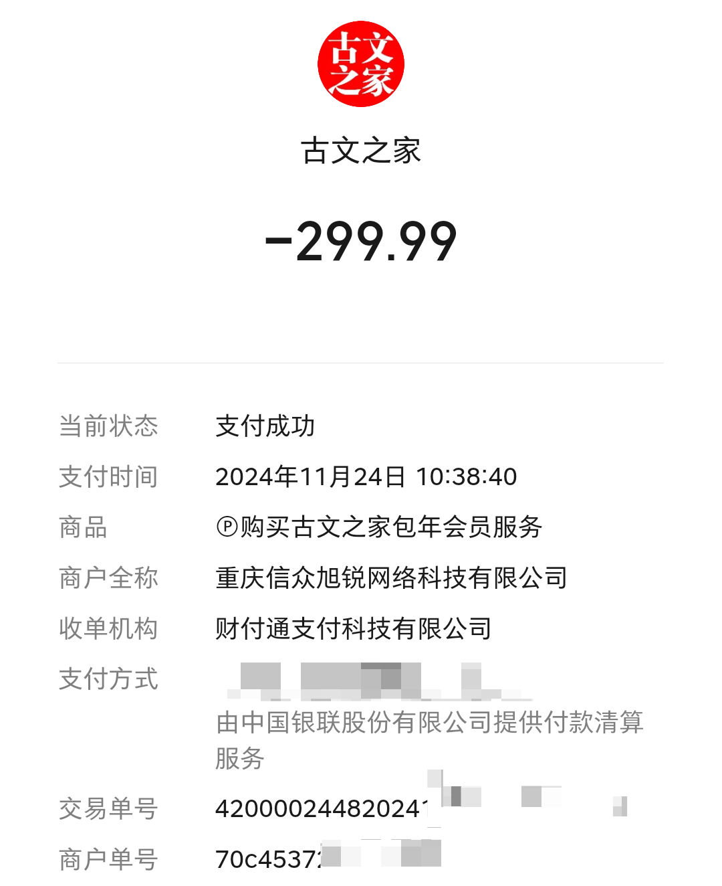

拼音字典数据采集和校正程序
=========================

## 项目初始化

```bash
yarn install
```

## 数据处理

- 从[汉典网](https://www.zdic.net)抓取原始字信息，
  并生成有效的字数据至 `data/pinyin-dict.valid.txt`：

```bash
npm run generate:raw
```

> - 完整的字数据放在 `data/pinyin-dict.raw.txt` 中，
>   仅当该文件不存在时，才重新从汉典网抓取全量字信息，
>   否则，仅更新 `data/pinyin-dict.valid.txt` 的数据；
> - 涉及按字形排序等的权重计算，故而生成时间会比较长；

> 注：解压 `data/pinyin-dict-data.zip` 也可以得到已经就绪的上述文件。

- 从 [EmojiXD](https://emojixd.com/) 抓取表情符号，
  并将 json 数据存放在 `data/emotions.json` 中：

```bash
npm run generate:emotion
```

- 根据 `data/pinyin-dict.valid.txt` 和 `data/emotions.json`
  将字、词拼音、表情符号等数据写入 SQLite 数据库
  `data/pinyin-word-dict.sqlite`：

```bash
npm run generate:sqlite:word
```

> 全新生成的 `pinyin-word-dict.sqlite` 中的汉字 id 会随机发生变化，
> 因此，建议在首次生成后，便不要删除该字典库（若要更新，则直接在已有库上累积即可），
> 否则，会导致输入法中已记录的用户词库与该字典库中的字无法准确对应，造成输入的混乱。

## 词组预测

### HMM

- 从[古文之家](https://www.cngwzj.com)抓取带拼音的古诗词和小学课文

```bash
npm run generate:phrase
```

> 拉取到的课文分别保存在文件
> `data/pinyin-dict-guci.raw.txt`（宋词三百首）、
> `data/pinyin-dict-gushi.raw.txt`（唐诗三百首）、
> `data/pinyin-dict-kewen.raw.txt`（小学课文）中，每一行都为
> JSON 数组，数组元素为课文内容及其字的拼音。

> 注：解压 `data/pinyin-dict-kewen-data.zip` 也可以得到已经就绪的上述文件。

> 注：为表示感谢，本团队已以购买打印服务方式资助该网站
> 。

- 生成 HMM 训练数据

```bash
npm run generate:sqlite:phrase:hmm:trans_kewen \
  -- -f data/pinyin-dict-kewen.raw.txt \
  -f data/pinyin-dict-gushi.raw.txt \
  -f data/pinyin-dict-guci.raw.txt
```

> `-f` 指定用于训练的带拼音数据的文件或目录位置，在目录内可分为多个文件和子目录。
> 训练完成后的数据将放在 `data/hmm_params/kewen/trans_prob.json` 中。

- 创建词典库

```bash
npm run generate:sqlite:phrase:hmm
```

> 生成的 SQLite 词典库放在 `data/pinyin-phrase-dict.sqlite` 中

## 输入法

### 词组输入功能验证

```bash
npm run app:shell
```

### 生成 Android 字/词典库

- 根据 `data/pinyin-word-dict.sqlite`
  和 `data/pinyin-phrase-dict.sqlite`
  向 Android 客户端生成`筷字输入法`专用的 SQLite 字典和词典库：

```bash
npm run generate:sqlite:ime
```

> - 以上字典库生成命令将自动对多余数据做删除，对新增数据做插入，
>   对有变化的数据做更新；
> - 若需要全新建库，则先删除字典库文件，再执行上述命令即可；

## 数据分析

打开 SQLite 数据库：

```bash
sqlite3 data/pinyin-word-dict.sqlite
```

### 按字查询

- 各类字体结构的代表字

```sql
select
  glyph_struct_,
  value_
from
  meta_word
group by
  glyph_struct_;
```

- 各类字体结构的前 50 个字

```sql
select
  glyph_struct_,
  -- substr 的截断长度需包含分隔符
  substr(group_concat(distinct value_), 0, 99)
from
  meta_word
group by
  glyph_struct_;
```

- 各类字体结构的部首分布

```sql
select
  glyph_struct_,
  word_,
  group_concat(distinct radical_)
from
  pinyin_word
group by
  glyph_struct_;
```

- 各类字体结构包含的字数

```sql
select
  glyph_struct_,
  count(distinct value_) as amount
from
  meta_word
group by
  glyph_struct_
order by
  amount desc;
```

- 各部首包含的字

```sql
select
  radical_,
  group_concat(distinct word_)
from
  pinyin_word
group by
  radical_
order by
  radical_stroke_count_ asc,
  weight_ desc;
```

- 各部首包含的字数

```sql
select
  radical_,
  count(distinct word_) as amount
from
  pinyin_word
group by
  radical_
order by
  amount desc;
```

- 根据笔画数排序的字

```sql
select
  value_,
  total_stroke_count_
from
  meta_word
order by
  total_stroke_count_ desc;
```

- 统计所有字包含的笔画

```sql
with recursive
  split_stroke (stroke, pos, stroke_name) as (
    select distinct
      stroke_order_,
      1,
      ''
    from
      meta_word
    union all
    select
      stroke,
      pos + 1,
      substr (stroke, pos, 1)
    from
      split_stroke
    where
      length (stroke) >= pos
  )
select distinct
  stroke_name
from
  split_stroke
where
  stroke_name != ''
order by
  stroke_name;
```

> - `1` 代表 `横`，`2` 代表 `竖`，`3` 代表 `撇`，`4` 代表 `捺`，`5` 代表 `折`

### 按拼音查询

- 各拼音包含的字数

> 若要查询注音字，则将表 `pinyin_word` 更改为 `zhuyin_word` 即可。

```sql
select
  spell_chars_,
  count(distinct word_) as amount
from
  pinyin_word
group by
  spell_chars_
order by
  amount desc;
```

- 根据拼音权重排序

```sql
select
  spell_chars_,
  group_concat(distinct word_)
from
  (
    select
      *
    from
      pinyin_word
    order by
      spell_weight_ desc
  )
group by
  spell_chars_
order by
  spell_chars_ asc;
```

- 某字（拼音）完整信息

> 若要查询注音字，则将表 `pinyin_word` 更改为 `zhuyin_word` 即可。

```sql
select
  id_,
  word_,
  unicode_,
  group_concat(distinct spell_),
  group_concat(distinct spell_chars_),
  glyph_struct_,
  radical_,
  stroke_order_,
  total_stroke_count_,
  radical_stroke_count_,
  traditional_,
  group_concat(distinct simple_word_),
  group_concat(distinct traditional_word_),
  group_concat(distinct variant_word_)
from
  pinyin_word
where
  word_ = '国'
group by
  id_;
```

- 查询某拼音的候选字

```sql
select distinct
  id_, word_, word_id_, unicode_,
  spell_, spell_id_,
  spell_chars_, spell_chars_id_,
  glyph_struct_, traditional_,
  radical_, radical_stroke_count_,
  stroke_order_, total_stroke_count_,
  weight_, spell_weight_, glyph_weight_
from
  pinyin_word where spell_chars_ = 'wo'
order by
  traditional_ asc,
  spell_weight_ desc, spell_id_ asc,
  radical_ asc, radical_stroke_count_ asc,
  glyph_weight_ desc;
```

- 拼音的字母组成

```sql
select
  substr (value_, 1, 1) as start_,
  group_concat (distinct value_)
from
  (
    select
      *
    from
      meta_pinyin_chars
    order by
      value_ asc
  )
group by
  start_
order by
  start_ asc;
```

- 声母后的韵母组成的拼音数

```sql
select
  start_,
  sum(total_),
  group_concat (follow_ || ':' || total_)
from
  (
    select
      substr (value_, 1, 2) as start_,
      substr (value_, 3, 1) as follow_,
      count(value_) as total_
    from
      meta_pinyin_chars
    where
      substr (value_, 1, 2) in ('ch', 'zh', 'sh')
    group by
      start_,
      follow_
    order by
      start_ asc,
      follow_ asc
  )
group by
  start_
union
select
  start_,
  sum(total_),
  group_concat (follow_ || ':' || total_)
from
  (
    select
      substr (value_, 1, 1) as start_,
      substr (value_, 2, 1) as follow_,
      count(value_) as total_
    from
      meta_pinyin_chars
    where
      substr (value_, 1, 2) not in ('ch', 'zh', 'sh')
    group by
      start_,
      follow_
    order by
      start_ asc,
      follow_ asc
  )
group by
  start_
order by
  start_ asc;
```

以上输出结果为：

```
j|14|i:10,u:4
q|14|i:10,u:4
x|14|i:10,u:4

o|2|:1,u:1
a|5|:1,i:1,n:2,o:1
e|5|:1,i:1,n:2,r:1

f|10|a:3,e:3,i:1,o:2,u:1
r|15|a:3,e:3,i:1,o:2,u:6
y|15|a:4,e:1,i:3,o:3,u:4
b|16|a:5,e:3,i:6,o:1,u:1
c|16|a:5,e:3,i:1,o:2,u:5
s|16|a:5,e:3,i:1,o:2,u:5
p|17|a:5,e:3,i:6,o:2,u:1
z|17|a:5,e:4,i:1,o:2,u:5
t|19|a:5,e:2,i:5,o:2,u:5
ch|19|a:5,e:3,i:1,o:2,u:8
sh|19|a:5,e:4,i:1,o:1,u:8
zh|20|a:5,e:4,i:1,o:2,u:8
m|20|:1,a:5,e:4,i:7,o:2,u:1
d|23|a:5,e:4,i:7,o:2,u:5

l|26|a:5,e:3,i:9,o:3,u:4,ü:2
n|27|:1,a:5,e:4,g:1,i:8,o:2,u:4,ü:2

w|9|a:4,e:3,o:1,u:1
g|19|a:5,e:4,o:2,u:8
k|19|a:5,e:4,o:2,u:8
h|21|a:5,e:4,m:1,n:1,o:2,u:8
```

- 各声母组成的拼音数

```sql
select
  substr (value_, 1, 2) as start_,
  count(value_) as total_,
  group_concat (distinct value_)
from
  (
    select
      *
    from
      meta_pinyin_chars
    where
      substr (value_, 1, 2) in ('ch', 'zh', 'sh')
    order by
      substr (value_, 3, 1) asc,
      length (value_) asc
  )
group by
  start_
union
select
  substr (value_, 1, 1) as start_,
  count(value_) as total_,
  group_concat (distinct value_)
from
  (
    select
      *
    from
      meta_pinyin_chars
    where
      substr (value_, 1, 2) not in ('ch', 'zh', 'sh')
    order by
      substr (value_, 2, 1) asc,
      length (value_) asc
  )
group by
  start_
order by
  total_ desc,
  start_ asc;
```

以上输出结果为：

```
zh|20|zha,zhai,zhan,zhao,zhang,zhe,zhei,zhen,zheng,zhi,zhou,zhong,zhu,zhua,zhui,zhun,zhuo,zhuai,zhuan,zhuang
ch|19|cha,chai,chan,chao,chang,che,chen,cheng,chi,chou,chong,chu,chua,chui,chun,chuo,chuai,chuan,chuang
sh|19|sha,shai,shan,shao,shang,she,shei,shen,sheng,shi,shou,shu,shua,shui,shun,shuo,shuai,shuan,shuang

n|27|n,na,nai,nan,nao,nang,ne,nei,nen,neng,ng,ni,nie,nin,niu,nian,niao,ning,niang,nou,nong,nu,nun,nuo,nuan,nü,nüe
l|26|la,lai,lan,lao,lang,le,lei,leng,li,lia,lie,lin,liu,lian,liao,ling,liang,lo,lou,long,lu,lun,luo,luan,lü,lüe
d|23|da,dai,dan,dao,dang,de,dei,den,deng,di,dia,die,diu,dian,diao,ding,dou,dong,du,dui,dun,duo,duan
h|21|ha,hai,han,hao,hang,he,hei,hen,heng,hm,hng,hou,hong,hu,hua,hui,hun,huo,huai,huan,huang
m|20|m,ma,mai,man,mao,mang,me,mei,men,meng,mi,mie,min,miu,mian,miao,ming,mo,mou,mu
g|19|ga,gai,gan,gao,gang,ge,gei,gen,geng,gou,gong,gu,gua,gui,gun,guo,guai,guan,guang
k|19|ka,kai,kan,kao,kang,ke,kei,ken,keng,kou,kong,ku,kua,kui,kun,kuo,kuai,kuan,kuang
t|19|ta,tai,tan,tao,tang,te,teng,ti,tie,tian,tiao,ting,tou,tong,tu,tui,tun,tuo,tuan
p|17|pa,pai,pan,pao,pang,pei,pen,peng,pi,pie,pin,pian,piao,ping,po,pou,pu
z|17|za,zai,zan,zao,zang,ze,zei,zen,zeng,zi,zou,zong,zu,zui,zun,zuo,zuan
b|16|ba,bai,ban,bao,bang,bei,ben,beng,bi,bie,bin,bian,biao,bing,bo,bu
c|16|ca,cai,can,cao,cang,ce,cen,ceng,ci,cou,cong,cu,cui,cun,cuo,cuan
s|16|sa,sai,san,sao,sang,se,sen,seng,si,sou,song,su,sui,sun,suo,suan
r|15|ran,rao,rang,re,ren,reng,ri,rou,rong,ru,rua,rui,run,ruo,ruan
y|15|ya,yan,yao,yang,ye,yi,yin,ying,yo,you,yong,yu,yue,yun,yuan
j|14|ji,jia,jie,jin,jiu,jian,jiao,jing,jiang,jiong,ju,jue,jun,juan
q|14|qi,qia,qie,qin,qiu,qian,qiao,qing,qiang,qiong,qu,que,qun,quan
x|14|xi,xia,xie,xin,xiu,xian,xiao,xing,xiang,xiong,xu,xue,xun,xuan
f|10|fa,fan,fang,fei,fen,feng,fiao,fo,fou,fu
w|9|wa,wai,wan,wang,wei,wen,weng,wo,wu
a|5|a,ai,an,ang,ao
e|5|e,ei,en,eng,er
o|2|o,ou
```

### 按表情查询

- 表情及其关键字信息

```sql
select
  id_,
  value_,
  group_,
  group_concat(keyword_, ', ')
from
  emoji
group by
  id_;
```

## 新旧版本数据迁移

Note：核心元数据（拼音、字、字读音）的 `id_` 和 `value_`
不能发生变化，否则，已发布的输入法将出现用户已输入短语失效的问题。

> 操作之前务必先备份旧版本的数据库文件。

```sql
pragma foreign_keys = 0;
pragma ignore_check_constraints = 1;

-- 直接删除不紧要或变更元数据不会影响输入法用户数据的表
drop table meta_word_cangjie_code;
drop table meta_word_sijiao_code;
drop table meta_word_wubi_code;
drop table meta_word_zhengma_code;
drop table meta_zhuyin;
drop table meta_zhuyin_chars;
drop table meta_phrase;
drop table link_phrase_with_pinyin_word;
drop table link_phrase_with_zhuyin_word;
drop table link_word_with_simple_word;
drop table link_word_with_traditional_word ;
drop table link_word_with_variant_word;
drop table link_word_with_zhuyin;
drop view pinyin_phrase;
drop view pinyin_word;
drop view simple_word;
drop view traditional_word;
drop view zhuyin_phrase;
drop view zhuyin_word;

-- 对核心的元数据表进行结构变更，直接变更为新版本的表结构
-- Note：新增的非空列，只能设置为 default null，完整性由代码检查
alter table meta_pinyin add column chars_id_ integer default null references meta_pinyin_chars (id_);
alter table meta_word drop column radical_;
alter table meta_word drop column radical_stroke_count_;
alter table meta_word add column radical_id_ integer default null references meta_word_radical (id_);

-- 添加新表，并从原始表中迁移元数据，以确核型元数据的 id 和相互间的关联不变
create table meta_word_with_pinyin (
  id_ integer not null primary key,
  -- 字 id
  word_id_ integer not null,
  -- 拼音 id
  spell_id_ integer not null,
  -- 字形权重：用于对相同拼音字母组合的字按字形相似性排序
  glyph_weight_ integer default 0,
  -- 按使用频率等排序的权重
  weight_ integer default 0,
  unique (word_id_, spell_id_),
  foreign key (word_id_) references meta_word (id_),
  foreign key (spell_id_) references meta_pinyin (id_)
);

insert into
  meta_word_with_pinyin (id_, word_id_, spell_id_, glyph_weight_, weight_)
select
  id_, source_id_, target_id_, glyph_weight_, weight_
from link_word_with_pinyin;

-- 删除旧表
drop table link_word_with_pinyin;

pragma foreign_keys = 1;
pragma ignore_check_constraints = 1;

-- 数据库无用空间回收
vacuum;

-- 执行数据更新/升级脚本: npm run generate:sqlite:word
-- 检查新旧版本数据是否存在差异（注意修改新旧数据库文件名）: npm run generate:sqlite:word:diff
```

## License

[Apache 2.0](https://www.apache.org/licenses/LICENSE-2.0)
